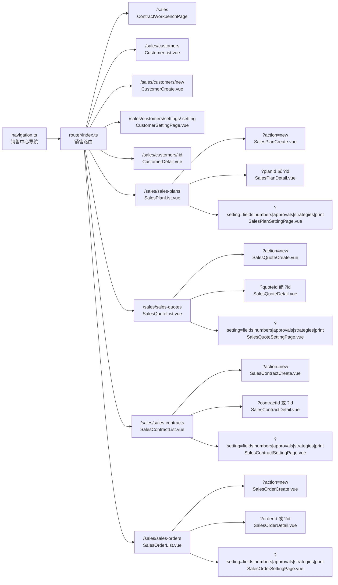
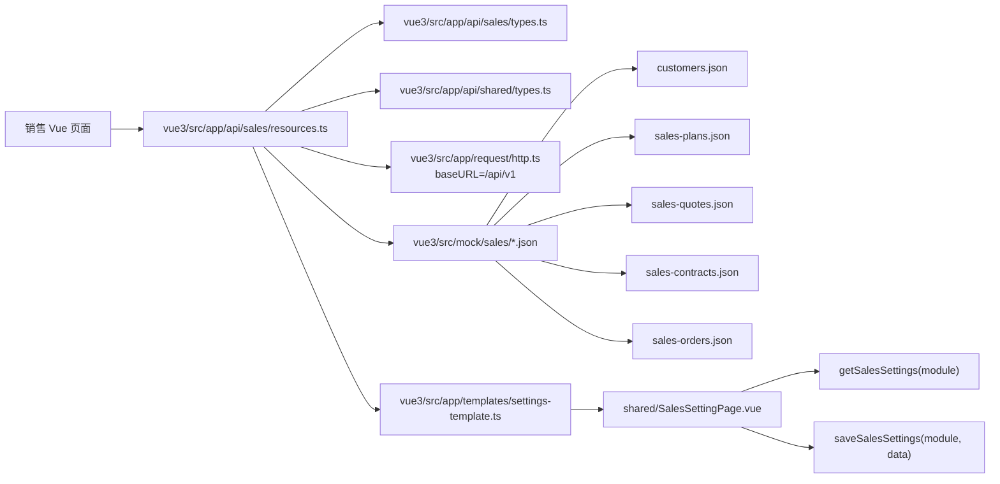
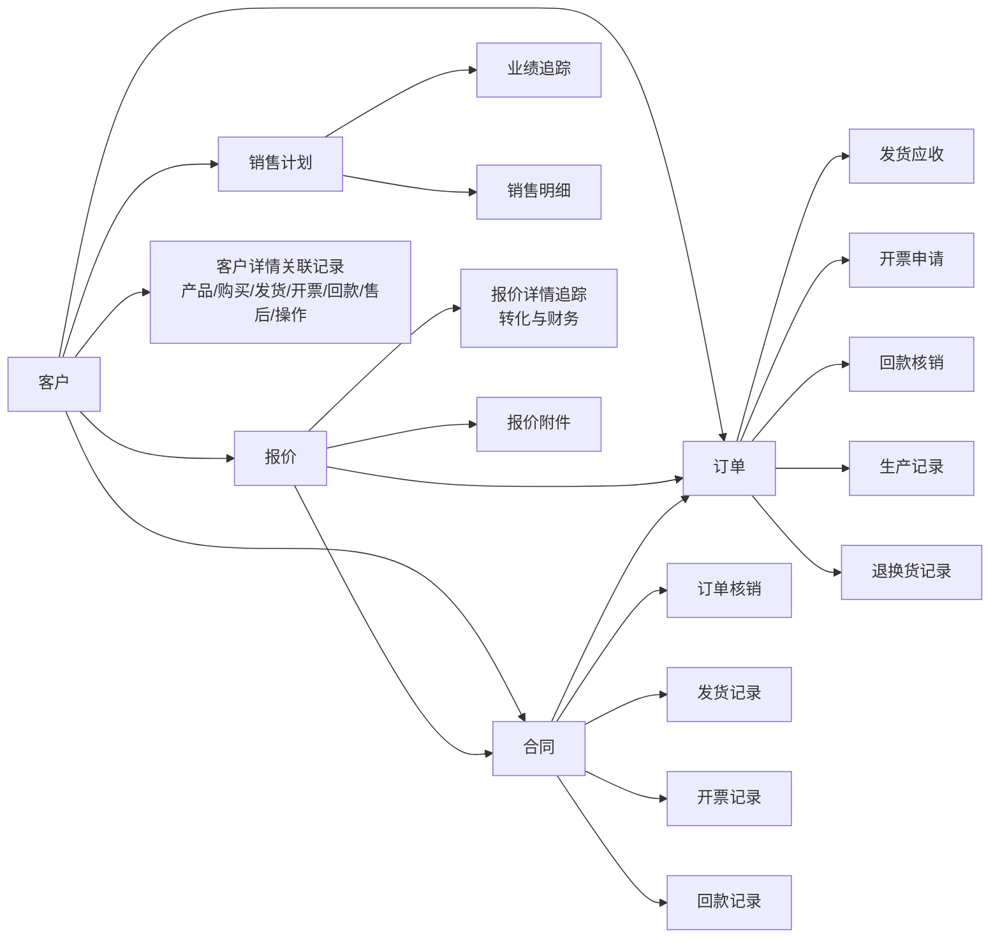
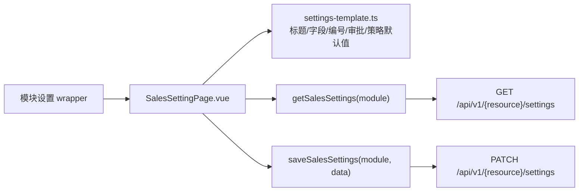

# 销售中心代码图谱

生成日期：2026-06-03

本文档基于当前 Vue3 工程生成，范围覆盖销售中心导航、路由、页面、公共母版、API 适配、mock 数据、设置契约和协同交接文档。不参考旧 JSX 页面。

## 1. 总览

销售中心当前由 5 个已实现业务域和 3 个预留业务域组成：

| 业务域 | 入口 | 状态 | 主要页面目录 | 数据入口 |
| --- | --- | --- | --- | --- |
| 客户管理 | `/sales/customers` | 已实现 | `vue3/src/views/sales/customers` | `listCustomers` / `createCustomer` |
| 销售计划 | `/sales/sales-plans` | 已实现 | `vue3/src/views/sales/sales-plans` | `listSalesPlans` / `createSalesPlan` |
| 报价管理 | `/sales/sales-quotes` | 已实现 | `vue3/src/views/sales/sales-quotes` | `listSalesQuotes` / `createSalesQuote` |
| 合同管理 | `/sales/sales-contracts` | 已实现 | `vue3/src/views/sales/sales-contracts` | `listSalesContracts` / `createSalesContract` / `getSalesContract` |
| 订单管理 | `/sales/sales-orders` | 已实现 | `vue3/src/views/sales/sales-orders` | `listSalesOrders` / `createSalesOrder` |
| 销售退货 | `/sales/sales-returns` | 预留 | 无专属 Vue 页面 | `contractCenters` 预留 |
| 销售换货 | `/sales/sales-exchanges` | 预留 | 无专属 Vue 页面 | `contractCenters` 预留 |
| 销售报表 | `/sales/sales-reports` | 预留 | 无专属 Vue 页面 | `contractCenters` 预留 |

当前 `/sales` 路由挂载的是 `vue3/src/views/contracts/ContractWorkbenchPage.vue`。`vue3/src/views/sales/SalesOverview.vue` 存在，但未作为当前销售中心工作台路由入口。

## 2. 入口与路由图谱

关键入口文件：

| 文件 | 职责 |
| --- | --- |
| `vue3/src/layouts/erp-shell/navigation.ts` | 注册销售中心导航、二级菜单、设置入口和预留菜单 |
| `vue3/src/app/router/index.ts` | 注册销售中心实际 Vue 路由 |
| `vue3/src/app/contracts/modules.ts` | 声明销售中心资源、API path、完整/预留状态 |
| `docs/sales-parallel-coordination.md` | 销售中心并行验收与路由参数约定 |
| `docs/sales-settings-contract-alignment.md` | 销售设置页 API 契约与复用规则 |

## 3. 页面文件图谱

```mermaid
flowchart TB
  SalesViews["vue3/src/views/sales"]

  SalesViews --> Shared["shared\n共享销售页面"]
  Shared --> SharedSetting["SalesSettingPage.vue\n计划/报价/合同/订单设置唯一共享入口"]
  Shared --> SimpleList["SimpleSalesList.vue\n遗留/备用列表封装"]

  SalesViews --> Customers["customers\n客户管理"]
  Customers --> CustomerListFile["CustomerList.vue\n列表"]
  Customers --> CustomerCreateFile["CustomerCreate.vue\n新增"]
  Customers --> CustomerDetailFile["CustomerDetail.vue\n详情"]
  Customers --> CustomerSettingFile["CustomerSettingPage.vue\n客户设置独立实现"]
  Customers --> CustomerConfig["customerList.config.ts\n列表字段/树配置"]

  SalesViews --> Plans["sales-plans\n销售计划"]
  Plans --> PlanListFile["SalesPlanList.vue\n列表/分流"]
  Plans --> PlanCreateFile["SalesPlanCreate.vue\n新增"]
  Plans --> PlanDetailFile["SalesPlanDetail.vue\n详情"]
  Plans --> PlanSettingFile["SalesPlanSettingPage.vue\nmodule=plans"]
  Plans --> PlanConfig["salesPlanList.config.ts\n列表字段"]

  SalesViews --> Quotes["sales-quotes\n报价管理"]
  Quotes --> QuoteListFile["SalesQuoteList.vue\n列表/分流"]
  Quotes --> QuoteCreateFile["SalesQuoteCreate.vue\n新增"]
  Quotes --> QuoteDetailFile["SalesQuoteDetail.vue\n详情"]
  Quotes --> QuoteSettingFile["SalesQuoteSettingPage.vue\nmodule=quotes"]
  Quotes --> QuoteConfig["salesQuoteList.config.ts\n列表字段/分类树"]

  SalesViews --> Contracts["sales-contracts\n合同管理"]
  Contracts --> ContractListFile["SalesContractList.vue\n列表/分流"]
  Contracts --> ContractCreateFile["SalesContractCreate.vue\n新增"]
  Contracts --> ContractDetailFile["SalesContractDetail.vue\n详情"]
  Contracts --> ContractSettingFile["SalesContractSettingPage.vue\nmodule=contracts"]
  Contracts --> ContractConfig["salesContractList.config.ts\n列表字段"]

  SalesViews --> Orders["sales-orders\n订单管理"]
  Orders --> OrderListFile["SalesOrderList.vue\n列表/分流"]
  Orders --> OrderCreateFile["SalesOrderCreate.vue\n新增"]
  Orders --> OrderDetailFile["SalesOrderDetail.vue\n详情"]
  Orders --> OrderSettingFile["SalesOrderSettingPage.vue\nmodule=orders"]
  Orders --> OrderConfig["salesOrderList.config.ts\n列表字段"]
```

## 4. API 与 mock 调用图谱

接口函数与远程契约：

| 函数 | mock 数据 | remote path | 调用页面 |
| --- | --- | --- | --- |
| `listCustomers(query)` | `customers.json` | `GET /customers` | `CustomerList.vue`、`CustomerDetail.vue` |
| `createCustomer(data)` | 追加 mock 结构 | `POST /customers` | `CustomerCreate.vue` |
| `listSalesPlans(query)` | `sales-plans.json` | `GET /sales-plans` | `SalesPlanList.vue`、`SalesPlanDetail.vue` |
| `createSalesPlan(data)` | 追加 mock 结构 | `POST /sales-plans` | `SalesPlanCreate.vue` |
| `listSalesQuotes(query)` | `sales-quotes.json` | `GET /sales-quotes` | `SalesQuoteList.vue`、`SalesQuoteDetail.vue` |
| `createSalesQuote(data)` | 追加 mock 结构 | `POST /sales-quotes` | `SalesQuoteCreate.vue` |
| `listSalesContracts(query)` | `sales-contracts.json` | `GET /sales-contracts` | `SalesContractList.vue` |
| `createSalesContract(data)` | 追加 mock 结构 | `POST /sales-contracts` | `SalesContractCreate.vue` |
| `getSalesContract(id)` | `sales-contracts.json` 单条 | `GET /sales-contracts/{id}` | `SalesContractDetail.vue` |
| `listSalesOrders(query)` | `sales-orders.json` | `GET /sales-orders` | `SalesOrderList.vue` |
| `createSalesOrder(data)` | 追加 mock 结构 | `POST /sales-orders` | `SalesOrderCreate.vue` |
| `getSalesSettings(module)` | `settings-template.ts` | `GET /{resource}/settings` | `shared/SalesSettingPage.vue` |
| `saveSalesSettings(module, data)` | 返回提交数据 | `PATCH /{resource}/settings` | `shared/SalesSettingPage.vue` |

设置页 `module` 到远程资源映射：

| module | resource | 设置页 wrapper |
| --- | --- | --- |
| `plans` | `sales-plans` | `sales-plans/SalesPlanSettingPage.vue` |
| `quotes` | `sales-quotes` | `sales-quotes/SalesQuoteSettingPage.vue` |
| `contracts` | `sales-contracts` | `sales-contracts/SalesContractSettingPage.vue` |
| `orders` | `sales-orders` | `sales-orders/SalesOrderSettingPage.vue` |

客户设置页不走该共享 `module` 映射，当前为 `customers/CustomerSettingPage.vue` 独立实现。

## 5. 母版组件依赖图谱

```mermaid
flowchart TB
  ListPages["列表页\nCustomerList / PlanList / QuoteList / ContractList / OrderList"]
  FormPages["新增页\nCustomerCreate / PlanCreate / QuoteCreate / ContractCreate / OrderCreate"]
  DetailPages["详情页\nCustomerDetail / PlanDetail / QuoteDetail / ContractDetail / OrderDetail"]
  SettingPages["设置页\nCustomerSettingPage / SalesSettingPage"]

  ListPages --> AwListPage["AwListPage"]
  ListPages --> AwListToolbar["AwListToolbar"]
  ListPages --> AwDataTable["AwDataTable"]
  ListPages --> AwResourceTree["AwResourceTree\n客户/报价使用"]
  ListPages --> AwSettingModal["AwSettingModal\n字段配置弹窗"]

  FormPages --> AwFormPage["AwFormPage"]
  FormPages --> AwEditableSubTable["AwEditableSubTable"]
  FormPages --> AwAttachmentTable["AwAttachmentTable\n客户/报价/订单使用"]
  FormPages --> AwRichTextEditor["AwRichTextEditor"]
  FormPages --> AwPaymentTermCards["AwPaymentTermCards\n客户使用"]
  FormPages --> AwPersonPickerModal["AwPersonPickerModal\n客户经理等"]

  DetailPages --> AwDetailPage["AwDetailPage"]
  DetailPages --> AwDetailToolbar["AwDetailToolbar"]
  DetailPages --> AwDetailHeader["AwDetailHeader"]
  DetailPages --> AwDetailInfoGrid["AwDetailInfoGrid"]
  DetailPages --> AwDetailTabs["AwDetailTabs"]

  SettingPages --> AwSettingPage["AwSettingPage"]
  SettingPages --> AwSettingToolbar["AwSettingToolbar"]
  SettingPages --> AwFieldSettingPage["AwFieldSettingPage"]
  SettingPages --> AwCodeRuleBuilder["AwCodeRuleBuilder"]
  SettingPages --> AwApprovalRuleEditor["AwApprovalRuleEditor"]
  SettingPages --> AwStrategySettingPage["AwStrategySettingPage"]
```

列表页遵循公共母版的三段式结构：顶部工具栏、表格、分页/批量区。新增页、详情页、设置页分别复用 `form-page`、`detail-page`、`setting-page` 目录下公共组件。

## 6. 业务链路关系图谱

说明：

- 客户、报价、合同、订单之间的业务关系主要体现在 mock 字段和详情页 Tab 数据中。
- 合同详情的订单核销、发货、开票、回款记录来自 `sales-contracts.json`。
- 订单详情的发货应收、回款、生产、操作记录来自 `sales-orders.json`；开票申请和退换货记录当前为页面内展示结构。
- 销售计划详情的业绩追踪、销售明细当前由页面内静态展示结构承载。

## 7. 模块调用清单

| 模块 | 列表页 | 新增页 | 详情页 | 设置页 |
| --- | --- | --- | --- | --- |
| 客户管理 | `CustomerList.vue` -> `listCustomers` | `CustomerCreate.vue` -> `createCustomer` | `CustomerDetail.vue` -> `listCustomers` 查单条 | `CustomerSettingPage.vue` 独立实现 |
| 销售计划 | `SalesPlanList.vue` -> `listSalesPlans` | `SalesPlanCreate.vue` -> `createSalesPlan` | `SalesPlanDetail.vue` -> `listSalesPlans` 查单条 | `SalesPlanSettingPage.vue` -> `SalesSettingPage(module="plans")` |
| 报价管理 | `SalesQuoteList.vue` -> `listSalesQuotes` | `SalesQuoteCreate.vue` -> `createSalesQuote` | `SalesQuoteDetail.vue` -> `listSalesQuotes` 查单条 | `SalesQuoteSettingPage.vue` -> `SalesSettingPage(module="quotes")` |
| 合同管理 | `SalesContractList.vue` -> `listSalesContracts` | `SalesContractCreate.vue` -> `createSalesContract` | `SalesContractDetail.vue` -> `getSalesContract` | `SalesContractSettingPage.vue` -> `SalesSettingPage(module="contracts")` |
| 订单管理 | `SalesOrderList.vue` -> `listSalesOrders` | `SalesOrderCreate.vue` -> `createSalesOrder` | `SalesOrderDetail.vue` 接收列表选中 `order` | `SalesOrderSettingPage.vue` -> `SalesSettingPage(module="orders")` |

## 8. 设置页契约

计划、报价、合同、订单设置页共用 `vue3/src/views/sales/shared/SalesSettingPage.vue`：

设置页交互约定：

| 设置类型 | 母版组件 | 说明 |
| --- | --- | --- |
| 自定义字段 | `AwFieldSettingPage` | 字段清单、显示/必填、排序、作用范围 |
| 自定义编号 | `AwCodeRuleBuilder` | 编号前缀、候选变量、预览 |
| 审批设置 | `AwApprovalRuleEditor` | 审批节点、审批方式、适用条件 |
| 策略设置 | `AwStrategySettingPage` | 模块策略 tabs 与规则项 |
| 打印模板 | `AwSettingPage` 内部表格 | 由 `SalesSettings.printTemplates` 承载 |

后端联调时应保持页面字段和设置页结构稳定，只切换 `resources.ts` 的请求模式或请求实现。

## 9. 资源与契约文件索引

| 路径 | 用途 |
| --- | --- |
| `vue3/src/app/api/sales/types.ts` | 销售实体、设置页、资源枚举类型 |
| `vue3/src/app/api/sales/resources.ts` | 销售中心 list/create/detail/settings API 适配 |
| `vue3/src/app/api/shared/types.ts` | `ListQuery`、`PageResult`、分页公共类型 |
| `vue3/src/app/request/http.ts` | 远程请求封装，统一 `/api/v1` baseURL |
| `vue3/src/app/templates/settings-template.ts` | 计划/报价/合同/订单设置默认模板 |
| `vue3/src/app/contracts/modules.ts` | 销售中心资源注册和预留模块声明 |
| `vue3/src/mock/sales/customers.json` | 客户 mock 数据 |
| `vue3/src/mock/sales/sales-plans.json` | 销售计划 mock 数据 |
| `vue3/src/mock/sales/sales-quotes.json` | 报价 mock 数据 |
| `vue3/src/mock/sales/sales-contracts.json` | 合同 mock 数据 |
| `vue3/src/mock/sales/sales-orders.json` | 订单 mock 数据 |
| `docs/sales-settings-contract-alignment.md` | 销售设置页契约对齐说明 |
| `docs/sales-parallel-coordination.md` | 销售中心验收调整协同公告板 |

## 10. 当前观察与风险

- `/sales` 当前工作台入口为 `ContractWorkbenchPage.vue`，不是 `SalesOverview.vue`。如后续要求销售专属工作台，需要同步路由和导航认知。
- 客户设置页为独立实现；计划、报价、合同、订单设置页走共享 `SalesSettingPage.vue`，与现有销售设置契约一致。
- 退货、换货、报表在导航和 `contractCenters` 中为预留状态，未发现专属销售 Vue 页面。
- 部分新增页仍存在页面内选择弹窗，例如产品、客户、来源、阶梯报价等；若验收要求统一弹窗，应优先评估是否迁移到公共选择器或新增公共组件。
- 订单详情由 `SalesOrderList.vue` 传入选中订单对象，不像合同详情那样单独调用 detail API；后续如切远程详情接口，需要补 `getSalesOrder(id)` 或等价契约。
